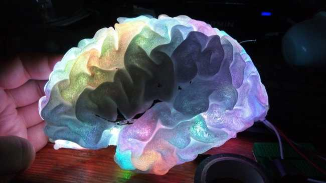

# Plastic Brain
> 3D real-time representation system of the brain activity.

OG 2019 - Project 07: PlasticBrain: real-time brain activity on a 3D printed brain
One to two paragraph statement about your product and what it does.



## Work flow

1. Arduino + LED
2. Hardware
3. EEG Acquisition
4. EEG Filtering
5. Inverse Problem (Sources Localization)
6. Sources to LED Model
7. Communication with the hardware.

## Install
* Clone this repository:
```
git clone https://github.com/italogfernandes/xablaus.git
```
* Install the packages and dependencies...
```
pip install -r requerements.txt
```
* Charge the arduino sketch.

## Running:

* Connect the arduino to your USB port.
* Starts the EEG data stream in your local network.
* Runs the main code:
```
python BrainHackScripts/brainHack.py
```

## License

This project is licensed under the MIT License - see the [LICENSE.md](LICENSE.md) file for details

## Authors

* **Jelena**
* **Gaetan**
* **Elif**
* **Jorge**
* **Victor**
* **Monique**
* **Italo Fernandes** - https://italogsfernandes.com - italogsfernandes@gmail.com

See also the list of [contributors](https://github.com/brainhack-ch/plastic-brain/contributors) who participated in this project.
